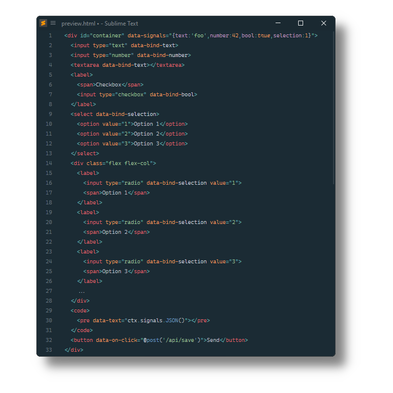

Datastar
========

[Datastar](https://data-star.dev/) syntax definitions and completions for [Sublime Text](https://www.sublimetext.com) based on its HTML and PHP syntaxes.

Datastar helps you build reactive web applications with the simplicity of server-side rendering
and the power of a full-stack SPA framework.



## Installation

### Package Control

The easiest way to install is using [Package Control](https://packagecontrol.io). It's listed as `Datastar`.

1. Open `Command Palette` using <kbd>ctrl+shift+P</kbd> or menu item `Tools → Command Palette...`
2. Choose `Package Control: Install Package`
3. Find `Datastar` and hit <kbd>Enter</kbd>

### Manual Install

1. Download appropriate [Datastar.sublime-package](https://github.com/SublimeText/Datastar/releases) for your Sublime Text build.
2. Rename it to _Datastar.sublime-package_
3. Copy it into _Installed Packages_ directory

> [!NOTE]
> To find _Installed Packages_...
>
> 1. call _Menu > Preferences > Browse Packages.._
> 2. Navigate to parent folder

## Requirements

- requires Sublime Text 4152+

## Supported Frameworks

### Astro

Datastar can be combined with [Astro](https://packagecontrol.io/packages/Astro).

Just create a _HTML (Astro, Datastar).sublime-syntax_ with following content in your _User_ package.

```yaml
%YAML 1.2
---
# http://www.sublimetext.com/docs/syntax.html
name: HTML (Astro, Datastar)
scope: text.html.Astro.Datastar
version: 2

extends:
  - Packages/Datastar/HTML (Datastar).sublime-syntax
  - Packages/Astro/Syntaxes/HTML (Astro).sublime-syntax
```

### Laravel Blade

Datastar can be combined with [Laravel Blade v2.0.0+](https://packagecontrol.io/packages/Laravel%20Blade).

Just create a _HTML (Blade, Datastar).sublime-syntax_ with following content in your _User_ package.

```yaml
%YAML 1.2
---
# http://www.sublimetext.com/docs/syntax.html
name: HTML (Blade, Datastar)
scope: text.html.blade.Datastar
version: 2

extends:
  - Packages/Datastar/PHP (Datastar).sublime-syntax
  - Packages/Laravel Blade/Syntaxes/HTML (Blade).sublime-syntax
```

### Elixir HEEx

Datastar can be combined with [ElixirSyntax](https://packagecontrol.io/packages/ElixirSyntax).

Just create a _HTML (HEEx, Datastar).sublime-syntax_ with following content in your _User_ package.

```yaml
%YAML 1.2
---
# http://www.sublimetext.com/docs/syntax.html
name: HTML (HEEx, Datastar)
scope: text.html.heex.Datastar
version: 2

extends:
  - Packages/Datastar/HTML (Datastar).sublime-syntax
  - Packages/ElixirSyntax/syntaxes/HTML (HEEx).sublime-syntax
```
